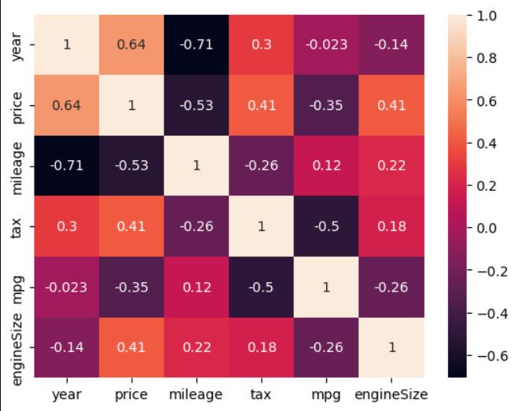

# 🚗 Ford Car Price Prediction

The Ford Car Price Prediction project is a machine learning-based application designed to estimate the market price of Ford vehicles using various technical and market-related features. In the automotive industry, accurately determining a vehicle's value is essential for both buyers and sellers, as it helps ensure fair pricing and informed decision-making.

---

## 📌 Project Overview

The goal of this project is to analyze Ford vehicle data and build a predictive model capable of estimating car prices accurately.

The project includes:

- Data Cleaning
- Exploratory Data Analysis (EDA)
- Feature Engineering
- Categorical Feature Encoding
- Feature Scaling
- Model Training
- Model Evaluation

---

## 📂 Dataset

The dataset contains information about Ford vehicles including:

| Feature | Description |
|----------|------------|
| model | Car model |
| year | Manufacturing year |
| transmission | Transmission type |
| mileage | Distance traveled |
| fuelType | Fuel type |
| tax | Road tax |
| mpg | Miles per gallon |
| engineSize | Engine size |
| price | Target variable |

---

## 🛠 Technologies Used

- Python
- Pandas
- NumPy
- Matplotlib
- Seaborn
- Scikit-Learn
- Jupyter Notebook

---

## 📊 Exploratory Data Analysis

The following visualizations were performed:

### Price Distribution
- Histogram with KDE plot

### Correlation Analysis
- Heatmap of numerical features

### Feature Relationships
- Year vs Price
- Mileage vs Price
- Engine Size vs Price
- Transmission vs Price
- Fuel Type vs Price
- MPG vs Price
- Tax vs Price

---

## ⚙️ Data Preprocessing

### Handling Categorical Features

Two encoding approaches were explored:

#### 1. One-Hot Encoding
```python
pd.get_dummies()
```

#### 2. Label Encoding
```python
LabelEncoder()
```

### Feature Scaling

StandardScaler was applied to numerical features:

```python
StandardScaler()
```

Features scaled:

- Year
- Mileage
- Tax
- MPG
- Engine Size

---

## 🤖 Machine Learning Model

### Linear Regression

The dataset was split into:

- Training Set: 67%
- Testing Set: 33%

```python
LinearRegression()
```

---

## 📈 Model Evaluation

The model performance was evaluated using:

- R² Score
- Mean Absolute Error (MAE)
- Mean Squared Error (MSE)

```python
r2_score()
mean_absolute_error()
mean_squared_error()
```

---

## 📁 Project Structure

```text
ford-car-price-prediction/
│
├── data/
│   └── ford.csv
│
├── notebooks/
│   └── ford-car-price-predicition.ipynb
│
├── images/
│   ├── price_distribution.png
│   ├── correlation_heatmap.png
│   └── other_visualizations
│
├── requirements.txt
├── README.md
└── LICENSE
```

---

## 🚀 Installation

Clone the repository:

```bash
git clone https://github.com/yourusername/ford-car-price-prediction.git
```

Navigate to the project directory:

```bash
cd ford-car-price-prediction
```

Install dependencies:

```bash
pip install -r requirements.txt
```

Run Jupyter Notebook:

```bash
jupyter notebook
```

---

## 🔮 Future Improvements

- Random Forest Regressor
- XGBoost Regressor
- Hyperparameter Tuning
- Model Deployment using Flask
- Streamlit Web Application
- Real-Time Price Prediction API

---

## 🎯 Results

The project successfully demonstrates how machine learning can be used to predict vehicle prices based on historical Ford car data.

Feature engineering, encoding techniques, and regression modeling were applied to build an effective predictive solution.

---

## 👨‍💻 Author

**Dheeraj Kumar**

Machine Learning & Data Science Enthusiast

---
## 📊 Visualizations



## Label Encoder Accuracy

## One-Hot Encoding Accuracy


